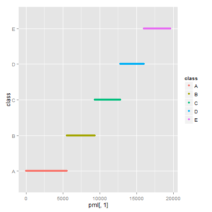
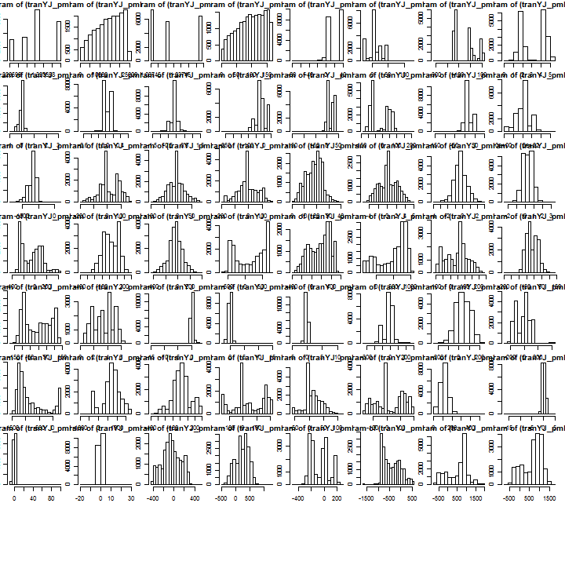

Predicting the Manner in Exercising
========================================================
In this paper, I show the steps about how to build a model for predicting the manner in exercising from the Weight Lifting Exercise Dataset. After the exploratory data analysis, data pre-processing, I use two models to make predictions: the decision tree model and the random forest. It turns out the random forest outperform the decision tree model.


`{r opts_chunk$set(cache=TRUE, echo = T, eval = T)`
## 1. Exploratory data analysis and data cleaning

The first thing that I noticed is that there are lots of missing values for many variables. In fact, for some variables, the missing values are huge and account for almost 90% of the data points. So I want to remove these variabls first.


```r
library(caret)
```

```
## Loading required package: lattice
## Loading required package: ggplot2
```

```r
library(ggplot2)
data <- read.csv("pml-training.csv", na.string = "NA")
data0 <- read.csv("pml-training.csv", na.string = "")
data99 <- read.csv("pml-testing.csv", na.string = "NA")

remove_NA <- function(data){
    col_num <- dim(data)[2]
    row_num <- dim(data)[1]
    na_col <- c()
    for (i in 1:col_num) {
        if (sum(is.na(data[,i])) > 0.5*row_num) na_col <- c(na_col,i) 
    }
    na_col
}

pml <- data[, -c(remove_NA(data0), remove_NA(data))]
pml99 <- data99[, -c(remove_NA(data0), remove_NA(data))]
rm(list= "data0")
```
Second, I noticed that some names of the variables are not regular and easy to understand; so I changed them. For example, I changed the first variable from "X"" to "row_name". And also, I changed the actual time type variable from the factor variable to the numeric variable. 


```r
colnames(pml)[1] <- "row_num"
colnames(pml)[dim(pml)[2]] <- "class"
colnames(pml99)[1] <- "row_num"
colnames(pml99)[dim(pml99)[2]] <- "class"
pml$cvtd_timestamp <-strptime(as.character(pml$cvtd_timestamp), format = "%m/%d/%Y %H:%M")
leftoverDate <- strptime(as.character(data$cvtd_timestamp[which(is.na(pml$cvtd_timestamp))]), format = "%d/%m/%Y %H:%M")
pml$cvtd_timestamp[which(is.na(pml$cvtd_timestamp))] <-leftoverDate
##transfer the time and date variable to numeric for further exploration
pml$cvtd_timestamp <- as.numeric(pml$cvtd_timestamp)

#########99 means testing set
pml99$cvtd_timestamp <-strptime(as.character(pml99$cvtd_timestamp), format = "%m/%d/%Y %H:%M")
leftoverDate99 <- strptime(as.character(data99$cvtd_timestamp[which(is.na(pml99$cvtd_timestamp))]), format = "%d/%m/%Y %H:%M")
pml99$cvtd_timestamp[which(is.na(pml99$cvtd_timestamp))] <-leftoverDate99
##transfer the time and date variable to numeric for further exploration
pml99$cvtd_timestamp <- as.numeric(pml99$cvtd_timestamp)
```

Then after simply cleaning the data, I did some exploratory data analysis. I scatter plot the outcome variable class with other variable. One thing I found was that the row_num is actually influenced the class a lot. You can see from the following figure. However, it shouldnot be: if you are predicting a small set of new data, then the number of the row shouldnot matter. So I remove the row num variable. 

```r
ggplot(pml, aes(x=pml[,1], y=class, colour=class)) +  geom_point()
```

 

```r
pml99 <- pml99[,-1]
pml <- pml[, -1]
```

## 2. Pre-processing the data
In this section, I will move to the step of the pre-processing the data. This step includes creating dummy variables for factor variables, check zero- and near Zero-variance predictors, identifying correlated predictors, linear dependencies checking, centering and scaling the data,imputation for the missing data, checking the normality of the data and ransforming predictors if necessary, and dimension reduction, etc.

First, I transfered the two factor variable, user.name and new.window to two sets of dummy variables.

```r
pml_n <- pml[, -which(!(lapply(pml, class) == "integer"| lapply(pml, class) == "numeric"))]
pml_f <- pml[, which(!(lapply(pml, class) == "integer"| lapply(pml, class) == "numeric"))[1:2]]
##to keep it as dataframe: datafram[n]
pml_outcome <- pml[which(!(lapply(pml, class) == "integer"| lapply(pml, class) == "numeric"))[3]]

pml_n99 <- pml99[, -which(!(lapply(pml99, class) == "integer"| lapply(pml99, class) == "numeric"))]
pml_f99 <- pml99[, which(!(lapply(pml99, class) == "integer"| lapply(pml99, class) == "numeric"))[1:2]]
##to keep it as dataframe: datafram[n]
pml_outcome99 <- pml99[which(!(lapply(pml99, class) == "integer"| lapply(pml99, class) == "numeric"))[3]]
##########################################
#### 1)dummy variable

#use not full-rank method--this is the default--NOt put one level as intercept
dumm_model<-dummyVars(~., data = pml_f, sep = "_")
pml_f_dum <- as.data.frame(predict(dumm_model, pml_f))


pml_f99[,2] <- (c("yes", rep("no",19)))##not sure why --because it should be 19 here
pml_f_dum99 <- as.data.frame(predict(dumm_model, pml_f99))
pml_f_dum99$new_window_no <- rep(1, 20)
pml_f_dum99$new_window_yes <- rep(0, 20)
```

Second, I checked whether there is any missing data and carried out imputation if necessary. It turns out that there is no missing data in my dataset.

Third, I checked whether there were any variable with 0 or near-zero variance, using the following code. There is no such variable, which is good.

```r
nzv <- nearZeroVar(pml_n, saveMetrics = TRUE)
sum(nzv$nzv)
```

```
## [1] 0
```

Forth, I checked the normality of the data. From the raw data, lots of variables are not normal shape. It is not a big issue for classification problem. But I still decided to carry on this pre-processing step. So I pickde the "YeoJohnson" method to transform the data.


```r
set.seed(777)
norm_tranYJ <-preProcess(pml_n, method = "YeoJohnson")
```

```
## Warning: Convergence failure: return code = 52
## Warning: Convergence failure: return code = 52
## Warning: Convergence failure: return code = 52
```

```r
tranYJ_pml_n <- predict(norm_tranYJ, pml_n)
tranYJ_pml_n99 <- predict(norm_tranYJ, pml_n99)
```
You can see that after transforming, the data looks better; but there are still some variables that are not in the bell shape.

```r
windows()
par(mfrow=c(8,8))
par(mar = rep(1,4))
for (i in seq_len(dim(pml_n)[2])){
    hist((tranYJ_pml_n[[i]]))    
    
}
```

 

Fifth, I centered and scaled the data. 


```r
center_scale <- preProcess(tranYJ_pml_n, method = c("center","scale"))
tranYJ_CS_pml_n <- predict(center_scale, tranYJ_pml_n)
tranYJ_CS_pml_n99 <- predict(center_scale, tranYJ_pml_n99)
```

Sixth, I checked the highly correlated variables, and remove them if the pearson correlation coefficients are higher than 0.85.


```r
descrCor <- cor(tranYJ_CS_pml_n)
summary(descrCor[upper.tri(descrCor)])
```

```
##    Min. 1st Qu.  Median    Mean 3rd Qu.    Max. 
## -0.9580 -0.1140  0.0013  0.0014  0.1010  0.8960
```

```r
highlyCorDescr <- findCorrelation(descrCor, cutoff = 0.85)
tranYJ_CS_ReCo_pml_n <- tranYJ_CS_pml_n[, -highlyCorDescr]
tranYJ_CS_ReCo_pml_n99 <- tranYJ_CS_pml_n99[, -highlyCorDescr]
descrCor2 <- cor(tranYJ_CS_ReCo_pml_n)
summary(descrCor2[upper.tri(descrCor2)])
```

```
##    Min. 1st Qu.  Median    Mean 3rd Qu.    Max. 
## -0.8000 -0.1050 -0.0005  0.0025  0.0993  0.8470
```

Seventh, I checked the linear dependency of the dataset. There were no variables that have linear dependency.

```r
findLinearCombos(tranYJ_CS_ReCo_pml_n)
```

```
## $linearCombos
## list()
## 
## $remove
## NULL
```

Eighth, I carried out the PCA, and set the threshold at 0.95 to pick up the number of components. After PCA, there are 29 variables left for further analysis.


```r
pca_model <- preProcess(tranYJ_CS_ReCo_pml_n, method = "pca", thresh = 0.95)
summary(pca_model)
```

```
##            Length Class  Mode     
## call          4   -none- call     
## dim           2   -none- numeric  
## bc            0   -none- NULL     
## yj            0   -none- NULL     
## et            0   -none- NULL     
## mean         50   -none- numeric  
## std          50   -none- numeric  
## ranges        0   -none- NULL     
## rotation   1450   -none- numeric  
## method        3   -none- character
## thresh        1   -none- numeric  
## pcaComp       0   -none- NULL     
## numComp       1   -none- numeric  
## ica           0   -none- NULL     
## k             1   -none- numeric  
## knnSummary    1   -none- function 
## bagImp        0   -none- NULL     
## median        1   -none- function 
## cols          0   -none- NULL     
## data          0   -none- NULL
```

```r
pca_model$numComp
```

```
## [1] 29
```

```r
tranYJ_CS_ReCo_PCA_pml_n<- predict(pca_model, tranYJ_CS_ReCo_pml_n)
tranYJ_CS_ReCo_PCA_pml_n99<- predict(pca_model, tranYJ_CS_ReCo_pml_n99)
```


## 3. Model selection and Comparison
After the pre-processing the data, because it is a classfication problem, now I applied just two models: one is a simple decision tree model; the other one is a random forest.  Before the fitting and comparison, I expected the random forest should be better, since it is quite a powerful model.

First, I fit the data into a decision tree model. I splitted the whole dataset into a training and a test dataset at a ratio of 0.9. This could provide me information about the out of the bag error(OOB) before I submit my answer online. In addition, I also used repeated cross validation method to infer the OOB in the training set. The code is as following:


```r
pml_pca <-cbind(tranYJ_CS_ReCo_PCA_pml_n,pml_f_dum, pml_outcome)
pml_pca99 <-cbind(tranYJ_CS_ReCo_PCA_pml_n99,pml_f_dum99, pml_outcome99)
set.seed(12312)
inTrain <- createDataPartition( y= pml_pca$class, p = 0.9, list = FALSE)
training <- pml_pca[inTrain, ]
testing  <- pml_pca[-inTrain, ]

fitControl <- trainControl(## repeated 10-fold CV
    method = "repeatedcv",
    number = 10,
    ## repeated  3 times
    repeats = 3)

set.seed(12023)
pca_mod_rpart_fit <- train(class~., data = training, method = "rpart" , trControl = fitControl)

testing_pca_rpart_predict <- predict(pca_mod_rpart_fit, testing)
sum(testing_pca_rpart_predict == testing$class)/length(testing_pca_rpart_predict)
```
So across the cross validation, I can see that the accuracy is only about 0.399, so the OOB is about .7;  when I applied the model to the testing set, the accuracy is about 0.38. This supports that the  OOB is quite huge here(0.7). 

The  second model is the random forest. The code is as below:


```r
set.seed(12312)
inTrain <- createDataPartition( y= pml_pca$class, p = 0.9, list = FALSE)
training <- pml_pca[inTrain, ]
testing  <- pml_pca[-inTrain, ]
set.seed(1770)
pca_mod_rf_fit <- train( class ~ .,data = training, method = "rf")
testing_pca_rf_predict <- predict(pca_mod_rf_fit, testing)
pml_pca99_pca_rf_predict <- predict(pca_mod_rf_fit, pml_pca99)
```
In random forest, we donot have to set cross validation since the model will automatically achieve that when resampleing subset each time. The final model has 37 predictors, with an accuracy of 0.971. So the OOB is aournd 0.03. When applied the model to the test set, it generates an accuracy of 0.981; this supports the OOB for this random forest should be aournd 0.03(might be a little bigger,since the testing set is processed at the same time the training model).

When I applied  the model with the final test set from the project, my 20 predictions are : B(wrong) A A(wrong) A(wrong) A E D B A A B C B A E E A B B B. The 1,3,and 4 predictions are wrong.


